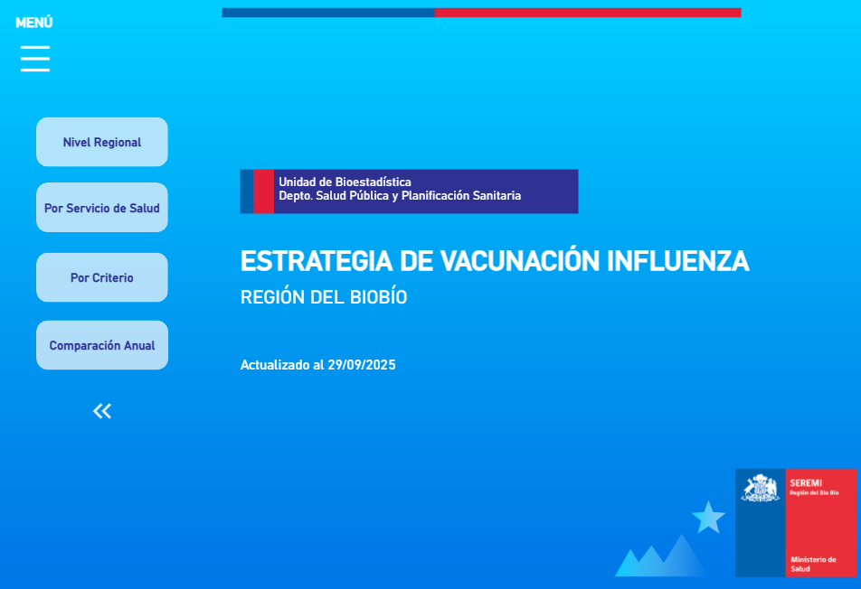
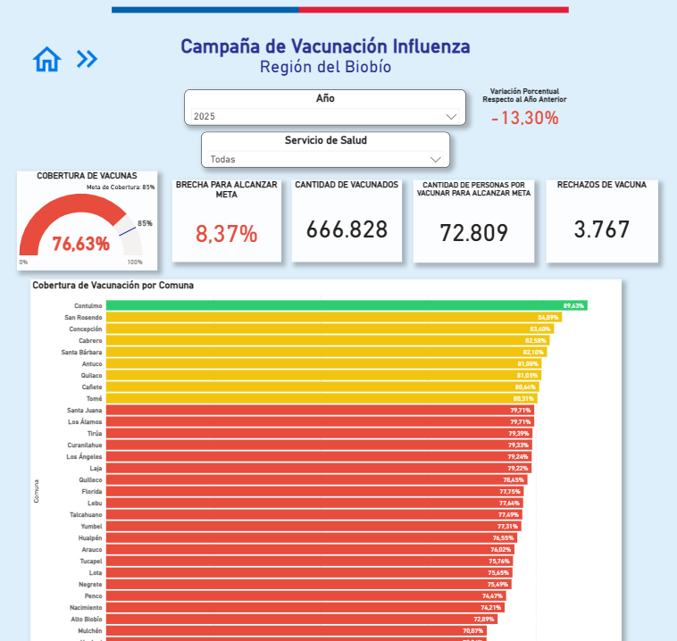
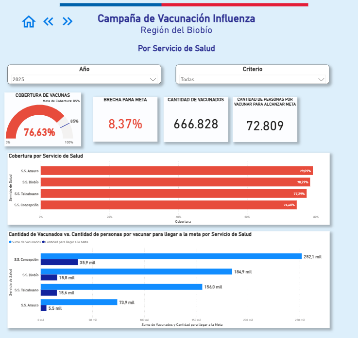
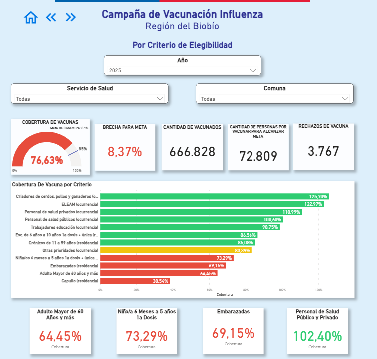
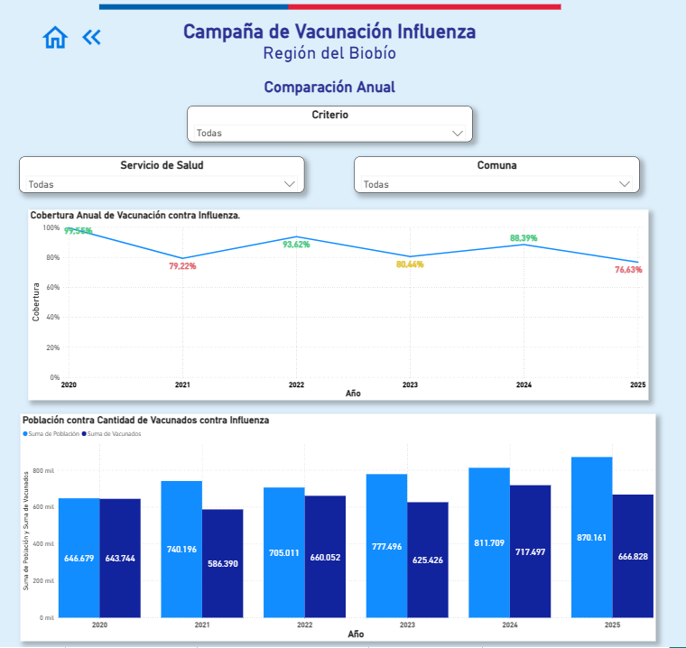
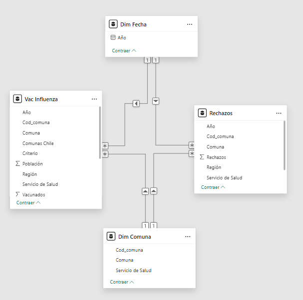

# 💉 Estrategia de Vacunación Influenza — Región del Biobío

> Dashboard interactivo en Power BI que analiza la cobertura de la campaña de vacunación contra la influenza en la Región del Biobío entre 2020 y 2025.

---

## 📌 Descripción del Proyecto

Este proyecto presenta un análisis visual de la cobertura de vacunación contra la influenza en la Región del Biobío. El dashboard fue desarrollado para la **Unidad de Bioestadística del Depto. de Salud Pública y Planificación Sanitaria — SEREMI Región del Biobío**, con última actualización al 29 de septiembre de 2025.

El objetivo del dashboard es apoyar la observación, monitoreo y ejecución de estrategias en el marco del **Programa Nacional de Inmunización (PNI)**, permitiendo a los equipos de salud tomar decisiones oportunas basadas en el avance de la cobertura vacunal por territorio, servicio de salud y grupo de elegibilidad.

Los datos son enviados mensualmente por el **Ministerio de Salud de Chile**. El proceso de actualización es semiautomático: basta con reemplazar el archivo fuente y actualizar el origen en Power Query para que todo el modelo y las visualizaciones se refresquen automáticamente.

---

## 🖼️ Vista Previa del Dashboard

### Portada

### Nivel Regional

### Por Servicio de Salud

### Por Criterio de Elegibilidad

### Comparación Anual

---

## 📊 Páginas del Dashboard

| Página | Descripción |
|---|---|
| **Portada** | Presentación del reporte con navegación principal |
| **Nivel Regional** | Cobertura regional, brecha para alcanzar la meta, vacunados y rechazos por comuna |
| **Por Servicio de Salud** | Cobertura y cantidad de vacunados desagregada por SS Arauco, Biobío, Concepción y Talcahuano |
| **Por Criterio de Elegibilidad** | Cobertura por grupo objetivo (adulto mayor, embarazadas, personal de salud, niños, entre otros) |
| **Comparación Anual** | Evolución de la cobertura y población vacunada entre 2020 y 2025 |

---

## 📈 Métricas Principales

- **Cobertura de vacunación** respecto a la meta regional (85%)
- **Brecha para alcanzar la meta** de cobertura
- **Cantidad de vacunados** y personas pendientes por vacunar
- **Rechazos de vacuna** registrados
- **Variación porcentual** respecto al año anterior
- **Comparación anual** de cobertura y población objetivo (2020–2025)
  
---

- ## 🎨 Formato Condicional

Los gráficos de cobertura utilizan colores para indicar el estado respecto a la meta regional (85%):

| Color | Condición | Significado |
|---|---|---|
| 🟢 Verde | Cobertura ≥ 85% | Meta alcanzada |
| 🟡 Amarillo | Cobertura ≥ 80% y < 85% | Próximo a la meta |
| 🔴 Rojo | Cobertura < 80% | Bajo la meta |

---

## 🔎 Filtros Disponibles

| Filtro | Opciones |
|---|---|
| Año | 2020 – 2025 |
| Servicio de Salud | Arauco, Biobío, Concepción, Talcahuano |
| Criterio de Elegibilidad | Adulto mayor, embarazadas, personal de salud, niños, ELEAM, entre otros |
| Comuna | Todas las comunas de la Región del Biobío |

---

## 🧩 Modelo de Datos

El modelo sigue una arquitectura tipo **estrella**, compuesta por:

**Tablas de hechos:**
- `Vac Influenza` — Población, vacunados, comuna, criterio, servicio de salud y año
- `Rechazos` — Cantidad de rechazos por comuna, servicio de salud y año

**Tablas de dimensión:**
- `Dim Fecha` — Año de la campaña
- `Dim Comuna` — Código de comuna, nombre y servicio de salud asociado

---

## 🛠️ Herramientas Utilizadas

- **Power BI Desktop** — Modelo de datos, medidas DAX y visualizaciones
- **Power Query** — Proceso de limpieza y transformación de datos
- **Excel / CSV** — Fuente de datos original (Ministerio de Salud de Chile)

---

## 📁 Fuente de Datos

- **Datos de vacunación:** proporcionados mensualmente por el **Ministerio de Salud de Chile** a través de la SEREMI Región del Biobío
- **Datos de población y criterios de elegibilidad:** extraídos del **Instituto Nacional de Estadísticas (INE)**
